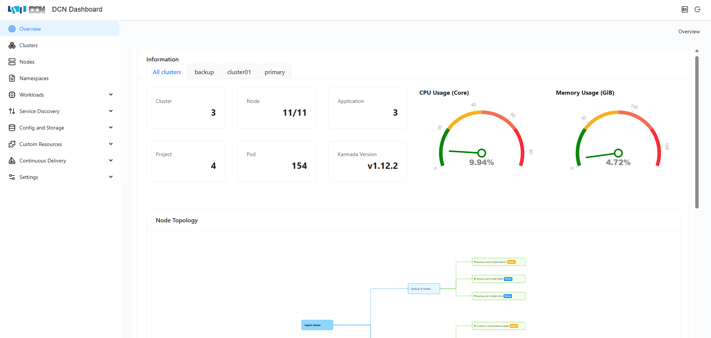
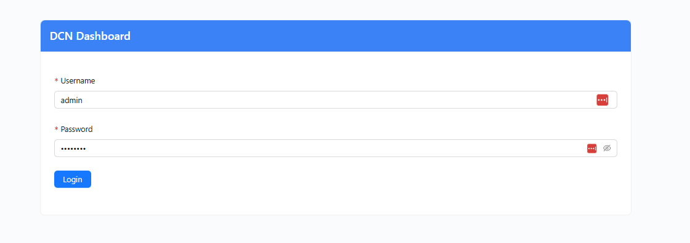

# Karmada-dashboard
[](https://github.com/kubernetes/dashboard/blob/master/LICENSE)

Karmada Dashboard is a general-purpose, web-based control panel for Karmada which is a multi-cluster management project.


## 🚀QuickStart

### Prerequisites
You need to have a Karmada installed on Kubernetes(aka. `host cluster`) and the [karmadactl](https://karmada.io/docs/installation/install-cli-tools#install-karmadactl) or
kubectl command-line tool must be configured to communicate with your host cluster and Karmada control plane.

If you don't already have the Karmada, you can launch one by following this [tutorial](https://karmada.io/docs/installation/#install-karmada-for-development-environment).


---
### Install Karmada-dashboard
In the following steps, we are going to install Karmada Dashboard on the `mgmt-cluster` where running the Karmada
control plane components. We assume that Karmada was installed in namespace `karmada-system` and mgmt-cluster config is 
located at `$HOME/.kube/config`, if this differs from your environment, please modify the following commands 
accordingly. 

1. Switch user-context of your mgmt-cluster config to `mgmt-cluster`.

```bash
export KUBECONFIG="$HOME/.kube/config"
kubectl config use-context kubernetes
```

2. Deploy Karmada Dashboard

Clone this repo to your machine:
```
git clone https://github.com/lehuannhatrang/dcn-dashboard
```

Change to the dashboard directory:
```
cd dcn-dashboard
```

First create secret based on your mgmt cluster config:
```
kubectl create secret generic kubeconfig-mgmt-cluster --from-file=kubeconfig=$HOME/.kube/config -n karmada-system
```

Deploy Karmada Dashboard:
```
./setup-nodeport-mode.sh
```

It should print results like this, this is the jwt token you need to login the 1st time to the dashboard:
```bash
JWT Token for authentication:
eyJhbGciOiJSUzI1NiIsImtpZCI6InZLdkRNclVZSFB6SUVXczBIRm8zMDBxOHFOanQxbWU4WUk1VVVpUzZwMG8ifQ.eyJpc3MiOiJrdWJlcm5ldGVzL3NlcnZpY2VhY2NvdW50Iiwia3ViZXJuZXRlcy5pby9zZXJ2aWNlYWNjb3VudC9uYW1lc3BhY2UiOiJrYXJtYWRhLXN5c3RlbSIsImt1YmVybmV0ZXMuaW8vc2VydmljZWFjY291bnQvc2VjcmV0Lm5hbWUiOiJrYXJtYWRhLWRhc2hib2FyZC10b2tlbi14NnhzcCIsImt1YmVybmV0ZXMuaW8vc2VydmljZWFjY291bnQvc2VydmljZS1hY2NvdW50Lm5hbWUiOiJrYXJtYWRhLWRhc2hib2FyZCIsImt1YmVybmV0ZXMuaW8vc2VydmljZWFjY291bnQvc2VydmljZS1hY2NvdW50LnVpZCI6ImE5Y2RkZDc3LTkyOWYtNGM0MS1iZDY4LWIzYWVhY2E0NGJiYiIsInN1YiI6InN5c3RlbTpzZXJ2aWNlYWNjb3VudDprYXJtYWRhLXN5c3RlbTprYXJtYWRhLWRhc2hib2FyZCJ9.F0BqSxl0GVGvJZ_WNwcEFtChE7joMdIPGhv8--eN22AFTX34IzJ_2akjZcWQ63mbgr1mVY4WjYdl7KRS6w4fEQpqWkWx2Dfp3pylIcMslYRrUPirHE2YN13JDxvjtYyhBVPlbYHSj7y0rvxtfTr7iFaVRMFFiUbC3kVKNhuZtgk_tBHg4UDCQQKFALGc8xndU5nz-BF1gHgzEfLcf9Zyvxj1xLy9mEkLotZjIcnZhwiHKFYtjvCnGXxGyrTvQ5rgilAxBKv0TcmjQep_TG_Q5M9r0u8wmxhDnYd2a7wsJ3P3OnDw7smk6ikY8UzMxVoEPG7XoRcmNqhhAEutvcJoyw
```


Then you will be able to access the Karmada Dashboard by `http://your-karmada-host:32000`.
Note that, the Karmada Dashboard service type is `NodePort`, this exposes the dashboard on a specific port on each node
of your `host cluster`, allowing you to access it via any node's IP address and that port.

You also can use `kubectl port-forward` to forward a local port to the Dashboard's backend pod:
```
kubectl port-forward -n karmada-system services/karmada-dashboard-web --address 0.0.0.0 8000:8000
```
Then you can access it via `http://localhost:8000`.

You still need the credentials and jwt token to login to the dashboard.


### Login Dashboard
Now open Karmada-dashboard with url [http://your-karmada-host:32000 ]()

Login to the dashboard with username and password:

Default username and password:
```
- username: admin
- password: admin123
```




The 1st time you login, you need to copy the token you just generated and paste it into the Enter token field on the login page. 

Once the process of authentication passed, you can use karmada dashboard freely. You can follow the Usage of karmada-dashboard to have a quick experience of  karmada dashboard.

Note: You may need to refresh the page after submitting the token.

### Uninstall

You can uninstall the dashboard and openfga by running the following command:
```
./setup-nodeport-mode.sh --uninstall
```

## Meeting

Regular Meeting For dashboard:
* Wednesday at 14:30 UTC+8 (Chinese)(biweekly). [Convert to your timezone](https://www.thetimezoneconverter.com/?t=14%3A30&tz=GMT%2B8&).
* There isn't a dedicated English meeting yet. If you have any topics to discuss, please join [the community meeting](https://github.com/karmada-io/karmada?tab=readme-ov-file#meeting).

Resources:
- [Meeting Notes and Agenda](https://docs.google.com/document/d/1dX3skCE-QRBWzABq3O9cG7yhIDUWLYWmg7kGq8UHU6s/edit)
- [Meeting Calendar](https://calendar.google.com/calendar/embed?src=a71aae8a75e3558a90683596c71382b8195bf7c84cb50e6e75d1a3e64e08480b%40group.calendar.google.com&ctz=Asia%2FShanghai) | [Subscribe](https://calendar.google.com/calendar/u/1?cid=YTcxYWFlOGE3NWUzNTU4YTkwNjgzNTk2YzcxMzgyYjgxOTViZjdjODRjYjUwZTZlNzVkMWEzZTY0ZTA4NDgwYkBncm91cC5jYWxlbmRhci5nb29nbGUuY29t)
- [Meeting Link](https://zoom.us/j/97070047574?pwd=lXha0Sqngw4mwtmArP1sjsLMMXk34z.1)

## 💻Contributing
Karmada dashboard is still catching up with the features of Karmada, we have only implemented the basic functionalities currently. 
If you want to contribute to the development of the Karmada dashboard, you can refer to the document of development, we are happy to see more contributors join us.
Please feel free to submit issues or pull requests to our repository.

## License

Karmada-dashboard is under the Apache 2.0 license. See the [LICENSE](LICENSE) file for details.
